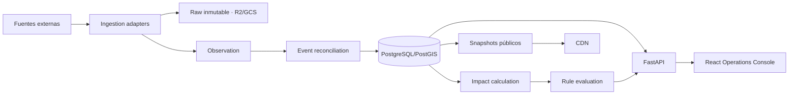

# Producto y arquitectura inicial de GeoOps

**Versión:** 1.0  
**Repositorio de referencia:** `pedromaaz13/incendios_forestales_app`  
**Nuevo repositorio:** `pedromaaz13/geoops-platform`

Este documento responde **qué construimos y cómo debe nacer el producto**.
El método diario de trabajo está en `02-SISTEMA-DE-TRABAJO.md`; el detalle del
pipeline está en `03-PIPELINE-Y-TRANSFORMACIONES.md`.

---

## 1. Decisión de producto

GeoOps será una plataforma operacional geoespacial que responda:

- qué está ocurriendo;
- dónde y desde cuándo;
- qué fuente lo afirma;
- qué antigüedad y precisión tiene la información;
- qué activos, rutas, parcelas o poblaciones pueden verse afectados;
- qué reglas se han activado;
- qué acciones se han realizado.

La propuesta de valor inicial es:

> Integrar eventos geoespaciales externos, cruzarlos con activos privados y
> convertirlos en impactos, alertas y flujos operativos verificables.

---

## 2. Relación con el repositorio de incendios

No se transforma ni se clona el repositorio actual.

```text
incendios_forestales_app
    producto público especializado
    pipeline wildfire
    generador de artefactos
    laboratorio de calidad
              │
              │ contrato versionado
              ▼
geoops-platform
    ontología genérica
    estado operacional
    API
    activos
    impactos
    reglas
    alertas
    consola operacional
```

El visor de incendios conserva:

- FIRMS, VIIRS, MODIS y MTG;
- limpieza y deduplicación térmica;
- clustering de focos;
- perímetros;
- fusión oficial–satélite;
- estados y vocabulario wildfire;
- publicación pública de alta resiliencia.

GeoOps reutiliza o generaliza:

- contrato de adaptadores;
- salud de fuentes;
- distinción entre tiempos;
- fixtures reales;
- validaciones;
- publicación y snapshots;
- exportación GeoJSON/Parquet/PMTiles;
- cálculos geoespaciales;
- carga diferida;
- pruebas y principios de honestidad.

---

## 3. Ontología operacional

La unidad de diseño deja de ser “una capa del mapa”.

```text
Source
  ejecuta SourceRun
  produce SourcePayload
  normalizado como Observation
             │
             ├── soporta
             ├── actualiza
             ├── contradice
             ▼
           Event
             │
             ├── afecta a Asset
             ├── intersecta Route
             ├── produce Impact
             ▼
          AlertRule
             ▼
           Alert
             ▼
            Case
```

Objetos mínimos de M0:

- `Source`
- `SourceRun`
- `SourcePayload`
- `Observation`
- `Event`
- `EventObservation`
- `EventRevision`

Objetos de M1/M2:

- `Organization`
- `Asset`
- `Route`
- `Impact`
- `AlertRule`
- `Alert`
- `Case`

---

## 4. Primera vertical y evolución

### M0 — Incendios

GeoOps consume los incidentes reconciliados del visor y los convierte en
observaciones y eventos persistentes.

### M1 — Eventos independientes

- avisos AEMET;
- cortes e incidencias DGT;
- terremotos IGN;
- activaciones Copernicus EMS;
- avisos hidrológicos.

AEMET y DGT dejan de ser solo “contexto de un incendio”: existen como eventos
propios aunque no haya fuego.

### M2 — Activos e impacto

- campings;
- subestaciones;
- plantas solares o eólicas;
- fincas;
- almacenes;
- torres;
- rutas;
- parcelas;
- explotaciones ganaderas.

### M3 — Reglas y alertas

```text
Evento
  ↓
Impacto calculado
  ↓
Regla
  ↓
Alerta
  ↓
Acuse / caso / acción
```

---

## 5. Arquitectura inicial



### Stack

Frontend:

```text
React
TypeScript
Vite
MapLibre GL JS
deck.gl cuando exista necesidad analítica
TanStack Query
Zustand para estado de UI
React Router
Vitest
Testing Library
Playwright
```

Backend:

```text
Python 3.12+
FastAPI
Pydantic
SQLAlchemy
Alembic
PostgreSQL + PostGIS
GeoAlchemy2
httpx
pytest
```

Persistencia:

```text
PostGIS      estado operacional y consultas espaciales
R2/GCS       payloads raw, snapshots, imágenes y evidencias
Parquet      histórico analítico
CDN          lectura pública de alta demanda
```

No entran en M0:

- Kafka;
- Kubernetes;
- Neo4j;
- Redis;
- Celery;
- WebSockets;
- microservicios independientes por dominio;
- IA predictiva.

---

## 6. Estructura inicial del repositorio

```text
geoops-platform/
├── AGENTS.md
├── README.md
├── Makefile
├── docker-compose.yml
├── .env.example
│
├── apps/
│   └── web/
│
├── services/
│   ├── api/
│   └── ingestion/
│
├── packages/
│   ├── contracts-python/
│   ├── contracts-ts/
│   ├── geo-python/
│   ├── map-layers/
│   └── ui/
│
├── infrastructure/
├── docs/
├── scripts/
├── tests/
└── .ai/
```

Aunque aparezcan varias carpetas, M0 funciona con:

- una API;
- una CLI o job de ingesta;
- una base de datos;
- una aplicación web.

No se separa un servicio hasta que exista una necesidad medida.

---

## 7. Interfaz de producto

El patrón visual se inspira en Disaster Ninja, no se copia literalmente.

```text
┌──────────────────────────────────────────────────────────────────┐
│ GeoOps · ámbito · tiempo · búsqueda · fuentes · organización     │
├─────┬──────────────────┬────────────────────┬─────────────────────┤
│ NAV │ EVENTOS          │ MAPA               │ CAPAS / LEYENDA     │
│     │ filtros          │                    │                     │
│ 🔥  │ incendio         │                    │ eventos             │
│ ⚠️  │ aviso            │                    │ meteorología        │
│ 🚧  │ corte            │                    │ infraestructura     │
│ 🌊  │ inundación       │                    │ activos             │
├─────┴──────────────────┴────────────────────┴─────────────────────┤
│ TIMELINE / ESTADO DE CARGA / REPRODUCCIÓN                        │
└──────────────────────────────────────────────────────────────────┘
```

Áreas:

- `/operations`: eventos gobernados y operación;
- `/sources`: salud y calidad;
- `/assets`: activos privados;
- `/alerts`: reglas y alertas;
- `/lab`: exploración libre con Kepler.gl o laboratorio propio.

---

## 8. Primera definición de terminado

GeoOps M0 termina cuando:

```text
[ ] El repositorio se instala desde cero.
[ ] PostGIS, API y web arrancan con Docker Compose.
[ ] Se importa el feed público del visor.
[ ] La segunda ejecución es idempotente.
[ ] Se almacenan observaciones inmutables.
[ ] Se crean eventos canónicos y revisiones.
[ ] La API consulta por bbox, tiempo y tipo.
[ ] La UI tiene mapa, lista, ficha, capas y fuentes.
[ ] Observed_at e ingested_at se muestran separados.
[ ] El estado conserva su procedencia.
[ ] La precisión y la incertidumbre son visibles.
[ ] CI ejecuta pruebas, typecheck, build y E2E.
[ ] Existe una demo desplegada.
```

El detalle de ejecución se encuentra en `10-ROADMAP-M0.md`.
