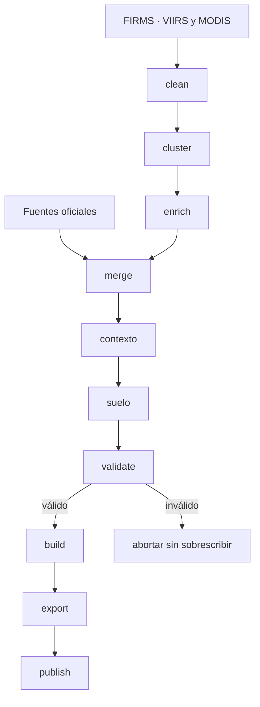
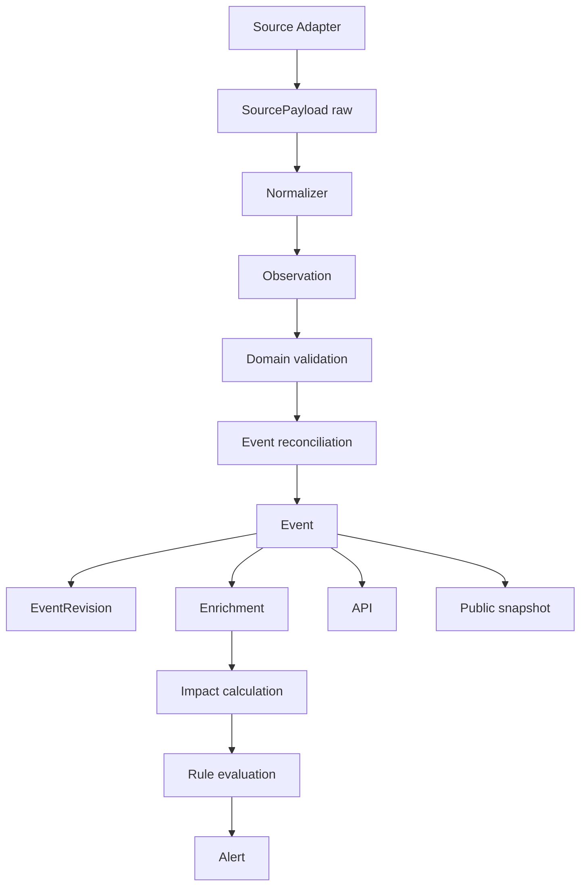

# Pipeline y transformaciones

## Estado MVP wildfire

El MVP implementa el primer flujo vertical con `wildfire-public`: lectura de
`manifest.json`, `incidents.geojson` y `sources.json`; conservación de raw en
`var/raw/`; normalización a `Observation`; reconciliación MVP a `Event`;
revisión ante cambios relevantes; cálculo de impacto por proximidad; y alerta
interna deduplicada. No hay scheduler ni adaptadores AEMET/DGT.

---

Este es el documento técnico más importante del arranque de GeoOps. Explica el
activo principal heredado de `incendios_forestales_app`: no un mapa, sino un
pipeline que convierte fuentes heterogéneas, parciales y potencialmente
engañosas en información verificable.

---

## 1. Pipeline actual de incendios



### 1.1 Ingesta

La ingesta:

- descarga sensores y fuentes oficiales;
- ejecuta fuentes de forma aislada;
- aplica reintentos controlados;
- distingue error, vacío y dato estancado;
- conserva tiempos de observación;
- registra salud de cada fuente.

### 1.2 Limpieza

`clean`:

- normaliza sensores;
- separa confianza;
- excluye falsos positivos conocidos;
- deduplica detecciones espacio–temporales;
- limita geometrías al territorio;
- conserva la observación original.

### 1.3 Agrupación

`cluster`:

- transforma puntos térmicos en candidatos a incendio;
- utiliza proximidad espacial y temporal;
- calcula centroides y perímetros;
- agrega sensores;
- estima superficie;
- evita mostrar cada hotspot como un incendio independiente.

### 1.4 Enriquecimiento

`enrich`, `contexto` y `suelo` añaden:

- municipio y provincia;
- núcleo y población próximos;
- uso del suelo;
- viento, temperatura y humedad;
- avisos oficiales;
- calidad del aire;
- cortes de carretera;
- infraestructura;
- evolución temporal.

### 1.5 Reconciliación

`merge`:

- enfrenta detecciones satelitales con partes oficiales;
- usa tolerancias por fuente;
- conserva origen;
- evita inventar un estado;
- mide separación entre observaciones;
- produce un incidente unificado.

### 1.6 Validación

Antes de publicar se ejecutan invariantes:

- esquema completo;
- IDs no duplicados;
- procedencia;
- geometría válida;
- tiempos coherentes;
- precisión positiva;
- incidente satelital respaldado;
- vocabulario correcto;
- ningún estado sin fuente oficial.

### 1.7 Publicación

La salida:

- no sustituye datos válidos por datos inválidos;
- publica latencias;
- exporta GeoJSON, Parquet y PMTiles;
- genera manifiesto;
- conserva el último estado válido;
- permite frontend estático y resistente a picos.

---

## 2. Transformación del pipeline en GeoOps



La nueva arquitectura conserva las etapas y cambia el vocabulario.

| Incendios | GeoOps |
|---|---|
| respuesta FIRMS/112 | `SourcePayload` |
| hotspot o parte | `Observation` |
| incendio agrupado | `Event` |
| fusión oficial–satélite | `EventReconciliation` |
| cambios del incendio | `EventRevision` |
| contexto | `Enrichment` |
| cercanía a activos | `Impact` |
| regla de aviso | `AlertRule` |
| publicación GeoJSON | `PublicSnapshot` |

---

## 3. Etapas del pipeline GeoOps

## 3.1 Adapter

Responsabilidad:

- autenticación;
- descarga;
- paginación;
- timeouts;
- límites;
- captura de headers;
- payload exacto;
- hash;
- metadatos del run.

No debe:

- decidir qué evento canónico existe;
- traducir estados a vocabulario final;
- calcular impactos;
- ocultar errores.

Salida:

```python
SourcePayload(
    source_id,
    fetched_at,
    media_type,
    body,
    content_hash,
    request_metadata,
)
```

## 3.2 Raw persistence

Todo payload útil se conserva de forma inmutable.

Ruta orientativa:

```text
raw/source=<source_id>/date=YYYY-MM-DD/run=<run_id>/payload.ext
```

Debe permitir:

- reprocesar;
- depurar;
- demostrar procedencia;
- comparar cambios;
- crear fixtures;
- auditar.

## 3.3 Normalizer

Transforma el vocabulario de la fuente en `Observation`.

Responsabilidades:

- mapear identificador;
- separar tiempos;
- crear geometría;
- declarar precisión;
- normalizar atributos;
- conservar campos no modelados;
- enlazar raw.

No debe:

- completar tiempos desconocidos con `now`;
- convertir ausencia de estado en “activo”;
- mejorar artificialmente precisión;
- generar un evento.

## 3.4 Observation validation

Validaciones genéricas:

```text
source_id presente
ingested_at presente
observed_at <= ingested_at, salvo desfase documentado
geometría válida
SRID conocido
precision_m > 0 o null
confidence entre 0 y 1 o null
event_type conocido
raw_uri disponible cuando proceda
source_record_id estable o estrategia de hash
```

Validaciones de dominio viven fuera del núcleo.

## 3.5 Persistence e idempotencia

Clave preferida:

```text
source_id + source_record_id + observation_version
```

Cuando no existe ID:

```text
source_id + canonical_payload_hash
```

Una segunda ingesta del mismo payload:

- no duplica observaciones;
- sí registra un nuevo `SourceRun`;
- puede actualizar métricas de salud;
- no genera revisiones falsas.

## 3.6 Event reconciliation

Reconciliar no es “hacer un join”.

Entrada:

- nueva observación;
- eventos candidatos por tipo, espacio y tiempo;
- reglas del dominio.

Salida:

```text
create_event
attach_to_event
update_event
contradict_event
ignore_observation
manual_review
```

Cada vertical tiene su reconciliador.

Ejemplos:

- incendio: ID upstream y, más adelante, continuidad espacial;
- aviso AEMET: identificador CAP y revisión;
- DGT: identificador DATEX;
- terremoto: event id IGN;
- inundación: cuenca, ventana y geometría.

## 3.7 Event

`Event` es la visión canónica actual.

Debe conservar:

- tipo y subtipo;
- geometría;
- estado;
- fuente del estado;
- severidad;
- tiempos;
- precisión;
- confianza;
- observaciones relacionadas;
- resumen;
- atributos de dominio.

Nunca sustituye las observaciones.

## 3.8 EventRevision

Se crea cuando cambian campos relevantes:

- geometría;
- estado;
- severidad;
- vigencia;
- título;
- fuente principal;
- precisión;
- relación con observaciones.

No se crea por cambios técnicos irrelevantes como una nueva hora de ingesta del
mismo payload.

## 3.9 Enrichment

Los enriquecimientos son funciones explícitas y versionadas.

Ejemplos:

```text
nearest_settlement_v1
land_cover_v1
protected_area_v1
weather_context_v1
population_exposure_v1
road_context_v1
```

Cada resultado declara:

- entrada;
- fuente;
- versión;
- tiempo;
- método;
- incertidumbre.

No mezclar enriquecimiento con datos de la fuente principal.

## 3.10 Impact calculation

`Impact` es una relación calculada entre `Event` y `Asset`.

M0/M2:

- distancia;
- intersección;
- buffer;
- umbral;
- razones;
- versión del cálculo.

Más adelante:

- viento;
- accesibilidad;
- exposición acumulada;
- criticidad;
- población;
- dependencias de infraestructura.

Ejemplo:

```json
{
  "impact_type": "proximity",
  "distance_m": 7420,
  "reasons": [
    "wildfire within configured 10 km threshold",
    "latest observation is 82 minutes old"
  ],
  "calculation_version": "proximity-v1"
}
```

## 3.11 Rule evaluation

Una regla evalúa impactos y eventos canónicos, no payloads crudos.

```text
Observation
  ↓
Event
  ↓
Impact
  ↓
AlertRule
  ↓
Alert
```

Así se evita enviar cuatro alertas por cuatro observaciones del mismo evento.

## 3.12 Snapshot y API

GeoOps tendrá dos caminos de lectura:

### Operacional

```text
PostGIS → FastAPI → Operations Console
```

### Público resiliente

```text
PostGIS → snapshot versionado → almacenamiento objeto → CDN
```

La base de datos permite consultas privadas y reglas. El CDN mantiene un portal
público resistente a picos.

---

## 4. Interfaces internas recomendadas

```python
class SourceAdapter(Protocol):
    source_id: str
    async def fetch(self, context: FetchContext) -> SourcePayload: ...


class ObservationNormalizer(Protocol):
    source_id: str
    def normalize(self, payload: SourcePayload) -> list[ObservationDraft]: ...


class ObservationValidator(Protocol):
    def validate(self, observation: ObservationDraft) -> ValidationResult: ...


class EventReconciler(Protocol):
    event_type: str
    async def reconcile(
        self,
        observation: Observation,
        candidates: list[Event],
    ) -> ReconciliationDecision: ...


class Enricher(Protocol):
    name: str
    version: str
    async def enrich(self, event: Event) -> EnrichmentResult: ...


class ImpactCalculator(Protocol):
    name: str
    version: str
    async def calculate(
        self,
        event: Event,
        assets: list[Asset],
    ) -> list[ImpactDraft]: ...
```

---

## 5. Orquestación inicial

M0 no necesita un orquestador complejo.

```text
Cloud Scheduler / cron
        ↓
Cloud Run Job o CLI
        ↓
pipeline run
```

Una ejecución:

1. crea `SourceRun`;
2. descarga;
3. guarda raw;
4. normaliza;
5. valida;
6. persiste observaciones;
7. reconcilia;
8. genera revisiones;
9. recalcula impactos afectados;
10. evalúa reglas;
11. actualiza salud;
12. exporta snapshot cuando corresponda.

Transacciones:

- una fuente no debe bloquear a las demás;
- la observación y su vínculo con el raw deben persistirse juntas;
- cada reconciliación debe ser atómica;
- los fallos de impacto no deben borrar eventos.

---

## 6. Errores silenciosos que deben diseñarse desde el inicio

- Respuesta HTTP 200 con payload vacío.
- Fuente que sigue respondiendo pero no publica datos nuevos.
- `observed_at` ausente sustituido por hora de ingesta.
- Coordenadas vacías convertidas en cero.
- Latitud y longitud que realmente son UTM.
- Estado de una fuente interpretado como estado del evento.
- ID upstream que cambia.
- Evento duplicado por pequeñas variaciones geométricas.
- Fuente oficial sin evento satelital y viceversa.
- Capa que falla al montarse sin bloquear la UI.
- Publicación parcial con ficheros de runs distintos.
- Regla que genera alertas repetidas.
- Revisión creada en cada ejecución sin cambio real.
- Enriquecimiento antiguo presentado como actual.

Todos necesitan prueba o métrica, no solo un comentario.

---

## 7. Qué no generalizar todavía

Permanecen en wildfire:

- clustering térmico;
- FRP;
- perímetros estimados;
- máscara industrial;
- relación hotspot–parte;
- estados de extinción;
- lógica de crecimiento.

Permanecen fuera de M0:

- motor universal de reconciliación;
- ontología dinámica editable;
- grafo dedicado;
- streaming de alta frecuencia;
- predicción;
- IA para decidir severidad.

---

## 8. Definition of Done del pipeline M0

```text
[ ] Raw inmutable.
[ ] SourceRun con estado explícito.
[ ] Normalización a Observation.
[ ] Validación genérica.
[ ] Idempotencia.
[ ] Reconciliación wildfire.
[ ] EventRevision ante cambios reales.
[ ] API por bbox y tiempo.
[ ] Snapshot exportable.
[ ] Métricas de cada etapa.
[ ] Fixtures.
[ ] Tests de error, vacío y stale.
[ ] Documentación de fuente y contrato.
```
